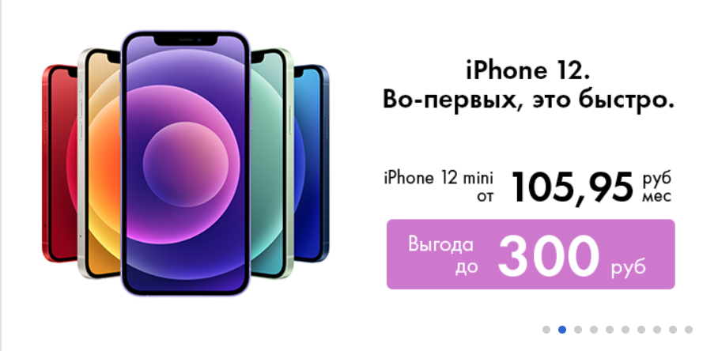
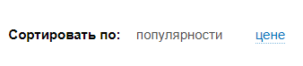

# RS Shop

| Deadline  |  Repo name   |
| --------  | ------------ |
|           | angular-shop |

**RS Shop** – приложение - интернет магазин со следующим функционалом:
- витрина с товарами
- корзина с товарами
- заказы
- администрирование

## Прототипы приложения

Прототипом приложения можно считать сайт электронного магазина 21 Век: https://www.21vek.by/
Задание - это упрощенная версия магазина. Примеры макетов и поведения можно смотреть в оригинале. Картинки товаров, их цены и описание в качестве исходных данных так же можно брать из оригинала. Задание следует выполнять как можно более приближеннее к оригиналу. Название магазина и перечень продаваемых товаров могут быть на ваше усмотрение:
- магазин по продаже любых товаров (типа 21 век)
- автомобильная тематика
- здоровье
- компьютерная техника
- косметика
- товары для животных
- литература
- и т.д.

## Структура приложения

1. [Хедер](#хедер):  
  1.1 Навигация  
  1.2 Навигация по категориям товаров  
  1.3 Блок работы с профилем  
1. [Футер](#футер)
1. [Главная страница магазина](#главная-страница-магазина)
1. [Страница товаров выбранной категории](#страница-товаров-выбранной-категории)
1. [Страница Детали товара](#Страница-детали-товара)
1. [Страница Акции](#страница-акции)
1. [Избранные товары](#избранные-товары)
1. [Просмотренные товары](#просмотренные-товары)
1. [Лист ожидания](#лист-ожидания)

## **Описание функциональных блоков**

### **Хедер**

Хедер должен содержать:

- #### Информационный блок:
    
  - блок выбора и изменения локации пользователя. Список локаций состоит ик крупных городов вашей страны. Изначально локация определяется автоматически по IP-адресу.
  
    
  - блок контактов: вайбер, мобильный телефон + дропдаун с выпадающим списком дополнительных контаков

    
    

  - блок с указанием времени работы контакт-центра

- #### Навигационный блок:
    
  - распологается под информационным блоком

  - содержит логотип (можно взять любой логотип)
  - содержит кнопку **"Каталог товаров"**, при нажатии на которую появляется панель (может быть страница) с категориями товаров   
  
    
  - категории товаров должны иметь уровни иерархии, например **Бытовая техника / Техника для ухода за одеждой / Утюги**  

    
  - панель разделена на 2 части - слева главные категории товаров (самый верхний уровень), справа вложенные уровни в виде списка в 2 колонки. При ховере слева на какую либо основную категорию, справа отображается список вложенных категорий. 

    
  - категории в левой имеют соответствующие иконки
  - реализовать поиск товаров по названию товара. Резутаты должны отображаться в выпадающем окне. Результаты поиска должны отображать список товаров подходящих под запрос с возможностью перейти на страницу с деталями любого из указанных товаров.

    
  Не нужно реализовывать отдельную страницу для результатов поиска, достаточно отобразить в выпадающем списке.
  - кнопку перехода в корзину
  - #### **Блок работы с профилем**
    - распологается в главной навигации в выпадающем списке

      
    - содержит краткое инфо об аккаунте (аватарка и имя пользователя)
    - содержит возможность перехода в корзину
    - вход/регистрация в аккаунт. Данные о зарегистрированном пользователе сохраняются в localStorage.
      
    - выход из аккаунта. При этом удалаются из localStorage данные о пользователе.
    - блок работы с товарами:
      - переход на страницу _Избранные товары_
      - переход на страницу _Просмотренные товары_
      - переход на страницу _История покупок_
  - ### **Навигация по категориям товаров**
    
  - выполнена под основной навигацией и содержит отдельно список основных (главных) категорий товаров
  - ссылку на страницу с акциями
  При клике должен быть переход на страницу категории товаров

### **Футер**

Содержит следующие элементы:

- блок контактов (аналогичных указанных в хедере, но без дропдауна)
- блок ссылок на социальные сети магазина

  

### **Главная страница магазина**

Главная страница содержит следующие елементы:

- #### Слайдер и карточки с категориями
  
  - слева расположен слайдер с набором акционных товаров, которые сменяются автоматически с заданным интервалом времени (задается самостоятельно)
  - справа расположен набор из 4 категорий товаров в виде карточек
  - при клике на карточку категории должен быть переход на **Страница товаров выбранной категории**
- #### Популярные товары
  
- необходимо выполнить в виде слайдера каждая страница которого состоит из 6 карточек популярных товаров.

### **Страница товаров выбранной категории**

- содержит иерархию выбранной котегории (breadcrumbs). Например : Туризм, активный отдых > Велосипеды, самокаты, ролики  
  
- название категории, например **Холодильники**
- список товаров в данной категории ввиде карточек  
  
  - наименование товара
  - изображение товара
  - есть ли в наличии или нет. Для товаров которых на складе более 20 окрашивать иконку в зеленый цвет, если от 5 до 19 - в желтый, если менее 5 в красный. 
  - цена
  - рейтинг
  - кнопка добавления в корзину
  - кнопка добавления в избранное
- должна быть возможность сортировки товаров по цене / скидке / популяности
  
- товары должны отображаться не все сразу, а группами по 10 штук, после них должна быть кнопка "Показать больше", по нажатию на которую подгружается еще группа из 10 товаров.

### **Страница Детали товара**

- должна содержть иерархию выбранной котегории (breadcrumbs). Например : Туризм, активный отдых > Велосипеды, самокаты, ролики
- Наименование товара
- Кнопка добавления в избранное
- Кнопка добавления в корзину
- Фотографии товара в виде вертикально слайдера

  
- если товар на акции, в правом верхнем углу должна быть иконка
- Секция с описанием товара и его характеристиками располагается под блоком с фотографиями

  

### **Страница Акции**

- список товаров на акции ввиде карточек , которые совержат следующую информацию:
  - изображение
  - наименование товара
  - цена
  - цена до акции
  - скидка
  - рейтинг
  - кнопка добавления в корзину

- реализовать возможность сортировки товаров по цене / скидке / дате окончания акции
- показывать кнопку **"Показать еще"** если товаров больше, чем влазит на одну страницу
  

### **Корзина**

  

#### Должна содержать:  
- список товаров с названием, изображением, кратким описанием, кол-вом (с возможностью изменения количества единиц товара, при это стоимость за данный товар должна пересчитываться), сроком доставки, стоимостью товара и возможностью перейти на данный товар
- информацию об общей стоимости заказа
- кнопку с подтверждением офрмления заказа

По созданию заказа показать подверждение: Ваш заказ создан успешно, ожидайте доставку в указанное время. После этого колличество единиц заказанных товаров в самом магазине должно уменьшиться.

### **Избранные товары**

Нобор карточек товаров в несколько колонок. Каждая карточка должна содержать:

- изображение товара
- наименование товара
- рейтинг (0-5 ввиде звезд)
- цену
- кнопку добавления в корзину
- кнопку идаления из избранного

### **Просмотренные товары**

Должно быть сделано аналогично избранным товарам за исключением что тут отсутствует кнопка удаления из избранных товаров

### **Лист ожидания**

Должен содержать информацию о каждом заказе пользователя ввиде списка (дизайн на ваше усмотрение). Каждый елемент списка это отдельный заказ - должен содержать информацию о доставке (дата предполагаемой доставки), стоимость к оплате, номер заказа, элементы отмены / редактирования заказа. Каждый заказ должен быть выполнен ввиде раскрывающегося списка с набором товаров в заказе (наименование товара / кол-во / цена / стоимость)

## Бекенд

В качестве бекенда можете использовать JSON server (или любую другую аналогичную бтблтльеку)
https://www.npmjs.com/package/json-server
Данные для приложения вам можно взять из оригинала приложения и составить соответствеющие gson документы для своего приложения. Такие данные разрешено копировать между командами.

## Требования к репозиторию

- для разработки приложения студент в своём аккаунте github создаёт приватный репозиторий
- название репозитория: **rs-shop**, название ветки, в которой ведётся разработка - **develop**, ветка **master** пустая, содержит только README.md
- история коммитов должна отображать процесс разработки приложения. [Требования к коммитам](https://docs.rs.school/#/git-convention)
- демо-версия приложения размещается на `gh-pages`, `netlify`, `heroku` либо на другом подобном хостинге.
  Для демоверсий, размещённых на `netlify` и `heroku`, название страницы дайте по схеме: rs-shop - гитхаб студента
- после окончания разработки или при наступлении дедлайна, создайте pull request из ветки разработки в ветку `main`. [Требования к pull request](https://docs.rs.school/#/pull-request-review-process?id=Требования-к-pull-request-pr). **Мержить Pull Request не нужно**
- репозиторий, в котором велась работа над проектом, после наступления дедлайна нужно сделать публичным.

## Технические требования

- работа приложения проверяется в браузере Google Chrome последней версии
- необходимо использовать Angular
- желательно использовать [bootstrap](https://getbootstrap.com/), [Angular material](https://material.angular.io/), css-фреймворки, html и css препроцессоры
- можно использовать js-библиотеки
- запрещено копировать код других студентов. Этот запрет касается html, css, js кода, дизайна. Можно использовать небольшие фрагменты кода со Stack Overflow, других самостоятельно найденных источников в интернете, за исключением github-репозиториев студентов курса. Возле использованного чужого фрагмента кода в комментарии указывается ссылка на источник.

## Как сабмитить задание

- Каждый студент самостоятельно сабмитит в rs app ссылку на pull request и получает баллы по результатам кросс-чека.
- Убедитесь, что pull request доступен для проверки. Для этого откройте ссылку, которую сабмитите в rs app, в режиме инкогнито браузера.
- Если задание не засабмитить до дедлайна, оно не попадёт на распределение при кросс-чеке и за него не будут выставлены баллы.

## Требования к оформлению приложения

- особое внимание обратите на качество оформления приложения. Как прототип можно использовать подходящие шаблоны, размещённые на [behance](https://www.behance.net/search/projects?tracking_source=typeahead_search_direct&search=learn%20english%20app%20design), [dribbble](https://dribbble.com/search/Learn%20English%20App), [pinterest](https://www.pinterest.com/search/pins/?q=learn%20english%20app%20design)
- качественное приложение характеризуется проработанностью деталей, вниманием к типографике (не больше трёх шрифтов на странице, размер шрифта не меньше 14 рх, оптимальная [контрастность шрифта и фона](https://snook.ca/technical/colour_contrast/colour.html)), тщательно подобранным контентом
- вёрстка адаптивная. Минимальная ширина страницы, при которой проверяется корректность отображения приложения - 500рх
- интерактивность элементов, с которыми пользователи могут взаимодействовать, изменение внешнего вида самого элемента и состояния курсора при наведении, использование разных стилей для активного и неактивного состояния элемента, плавные анимации
- единство стилей всех страниц приложения - одинаковые шрифты, стили кнопок, отступы, одинаковые элементы на всех страницах приложения имеют одинаковый внешний вид и расположение. Цвет элементов и фоновые изображения могут отличаться. В этом случае цвета используются из одной палитры, а фоновые изображения из одной коллекции.

## Критерии оценивания

### Вёрстка, дизайн, UI +40

Хедер
Футер
Навигация
Блок работы с профилем
Навигация по категориям товаров
Страница категории товаров
Страница деталей товара
Страница с акциями
Главная страница магазина
Избранные товары
Просмотренные товары
Лист ожидания

### Верстка +30

- [ ] вёрстка и дизайн всего приложения выполнены в едином стиле +10
- [ ] 
- [ ] собственный оригинальный интересный качественный дизайн приложения +10
- [ ] использование **Angular material**  +10

### Хедер +45

- [ ] меню +10
- [ ] описание возможностей и преимуществ приложения +10
- [ ] видео с демонстрацией работы приложения +10
- [ ] раздел "О команде" +10

### Футер +20

- [ ] блок контактов (аналогичных указанных в хедере, но без дропдауна) +10
- [ ] блок ссылок на социальные сети магазина +10

### Страница категории товаров

- [ ]  +10
- [ ]  +10

### Страница деталей товара

- [ ]  +10
- [ ]  +10

### Страница с акциями

- [ ]  +10
- [ ]  +10

### Главная страница магазина

- [ ]  +10
- [ ]  +10

### Избранные товары

- [ ]  +10
- [ ]  +10

### Просмотренные товары

- [ ]  +10
- [ ]  +10

### Лист ожидания

- [ ]  +10
- [ ]  +10

<!-- ### Бекенд +60

- [ ] при регистрации нового пользователя можно указать его имя и загрузить фото. При перезагрузке приложения данные о пользователе сохраняются +10
- [ ] у пользователя есть возможность редактировать ранее указанные данные - изменить имя и фото +10
- [ ] реализована авторизация и разавторизация пользователя. Основная часть приложения доступна без авторизации. Авторизация необходима только для хранения долгосрочной статистики и формирования словаря +10
- [ ] создана база данных MongoDB +10
- [ ] собственная копия бекенда размещена на heroku +10
- [ ] приложение использует данные из собственного API +10

### Дополнительный функционал +30\*\*

- [ ] реализован не указанный в задании дополнительный функционал. Оценивается оригинальная идея, вклад в улучшение качества приложения, полезность, сложность и качество выполнения +20
- [ ] написано не меньше 10 юнит-тестов (не созданных автоматически) +10 -->

## Cross-check

- инструкция по проведению cross-check: https://docs.rs.school/#/cross-check-flow

## Документ для вопросов

- документ для вопросов, связанных с выполнением задания: [ссылка здесь](https://docs.google.com/spreadsheets/d/1X82ONIAqDJ2JoliqBUMTrYu2tKhC5AMSB16GPrn3les/edit?usp=sharing)
